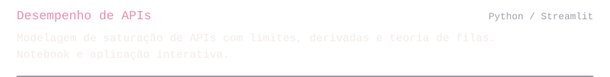

  <picture>
    <source media="(max-width: 640px)" srcset="./assets/dashboard-mobile.svg" />
    
  </picture>

  <picture>
    <source media="(max-width: 640px)" srcset="./assets/footer/projects-heading-mobile.svg" />
    
  </picture>
  <a href="https://github.com/BrThiagoN/serah-googleExtension">
    <picture>
      <source media="(max-width: 640px)" srcset="./assets/footer/serah-mobile.svg" />
      
    </picture>
  </a>
  <a href="https://github.com/BrThiagoN/Limite-de-desempenho-de-API">
    <picture>
      <source media="(max-width: 640px)" srcset="./assets/footer/api-performance-mobile.svg" />
      
    </picture>
  </a>
  <a href="https://github.com/BrThiagoN/music-store-cli">
    <picture>
      <source media="(max-width: 640px)" srcset="./assets/footer/music-store-cli-mobile.svg" />
      
    </picture>
  </a>
  <a href="https://github.com/BrThiagoN/vinharia-agnelo-arduino">
    <picture>
      <source media="(max-width: 640px)" srcset="./assets/footer/vinharia-agnello-mobile.svg" />
      
    </picture>
  </a>

  <picture>
    <source media="(max-width: 640px)" srcset="./assets/footer/contact-heading-mobile.svg" />
    
  </picture>
  <a href="https://www.linkedin.com/in/thiagonascimento08/">
    <picture>
      <source media="(max-width: 640px)" srcset="./assets/footer/linkedin-mobile.svg" />
      
    </picture>
  </a>
  <a href="mailto:thiagotgn6@gmail.com">
    <picture>
      <source media="(max-width: 640px)" srcset="./assets/footer/email-mobile.svg" />
      
    </picture>
  </a>
  <a href="https://github.com/BrThiagoN">
    <picture>
      <source media="(max-width: 640px)" srcset="./assets/footer/github-mobile.svg" />
      
    </picture>
  </a>

