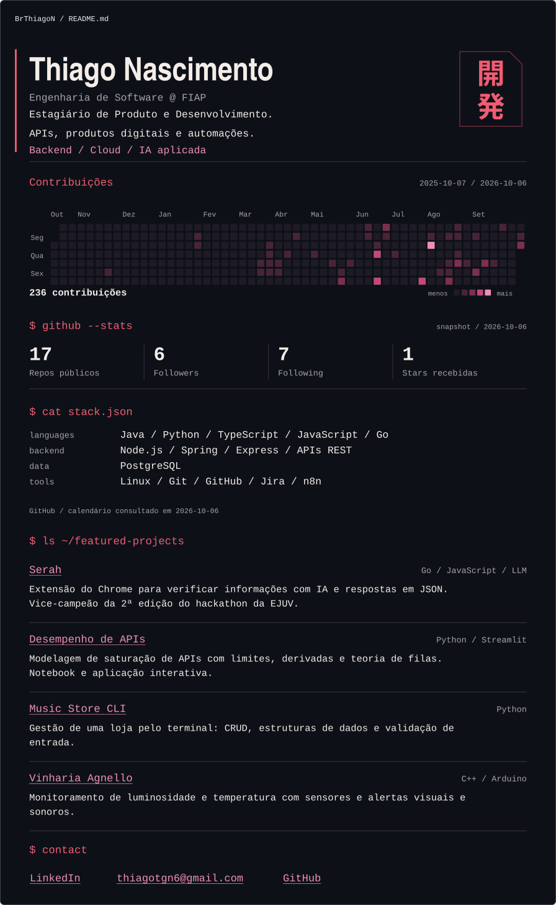
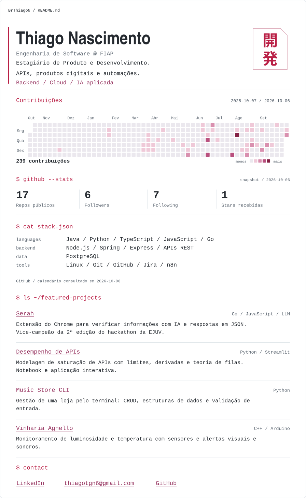

# Manutenção do dashboard

O README apresenta o perfil e os quatro projetos originais. A composição visual é gerada em SVG transparente, com temas claro e escuro automáticos, tipografia condensada e monoespaçada, vermelho/rosa e um selo japonês vetorial. O layout é dimensionado para a coluna de README do GitHub; a sidebar e o avatar ficam na interface nativa do perfil. O calendário tem uma única onda de entrada. Não há dependência de widgets externos.

## Arquivos

| Arquivo | Responsabilidade |
| --- | --- |
| `scripts/profile.json` | Textos, stack, descrições e destinos dos quatro projetos, derivados do README anterior. |
| `scripts/generate_dashboard.py` | Consulta dados, valida snapshots e desenha o dashboard e as linhas do rodapé. Python 3.12+, biblioteca padrão. |
| `assets/profile-data.json` | Último resultado válido de cada fonte, com período e data da consulta. Sem credenciais. |
| `assets/avatar.jpg` | Avatar real preservado como asset; a interface do GitHub já mostra a foto fora do README. |
| `assets/development-mark.svg` | Selo “開発” (desenvolvimento), com glifos convertidos em contornos SVG. |
| `assets/dashboard.svg` | Documento para a coluna do README, `viewBox="0 0 880 808"`. |
| `assets/dashboard-mobile.svg` | Layout vertical, `viewBox="0 0 440 1224"`, com o mesmo calendário em duas faixas. |
| `assets/footer/*.svg` | Títulos, linhas de projetos e links de contato; versões desktop/mobile, transparentes e com tema automático. |
| `assets/previews/*.png` | Oito prévias estáticas: dashboard e retângulo do README, desktop/mobile, claro/escuro. |
| `scripts/render_previews.py` | Ferramenta opcional de revisão local para exportar as prévias PNG com tema explícito e calendário completo. |
| `docs/design-notes.md` | Paleta, tipografia, proporções e decisões da direção visual. |
| `.github/workflows/update-profile.yml` | Validação e atualização diária, manual ou por push relevante. |
| `tests/test_generate_dashboard.py` | Falhas de API, integridade de dados, segurança e limites dos painéis. |

Edite os textos, a stack e as descrições dos projetos em `scripts/profile.json`. Os destinos clicáveis e textos alternativos ficam nos atributos `href` e `alt` do README; ao alterar um projeto ou contato, mantenha-os consistentes com a configuração. Depois regenere os SVGs. Não edite os SVGs manualmente.

## Geração local

Reproduzir exatamente os assets versionados, sem token ou acesso à rede:

```sh
python3 scripts/generate_dashboard.py --offline
python3 scripts/generate_dashboard.py --offline --check
python3 -m unittest discover -s tests -v
```

Atualizar os dados quando `GITHUB_TOKEN` já estiver definido no ambiente:

```sh
python3 scripts/generate_dashboard.py
```

Sem token, o modo padrão termina com código 2 e uma orientação clara, antes de escrever arquivos. O script não lê `.env`, não recebe token por argumento e não imprime respostas de autenticação.

Para um bootstrap público local, há um modo explícito sem token:

```sh
python3 scripts/generate_dashboard.py --public
```

Esse modo usa REST público e o calendário publicado pelo próprio GitHub. O parser exige data, contagem e intensidade de todos os dias do período. Uma mudança no HTML causa falha desse componente, preservando o snapshot anterior; dias ausentes nunca são convertidos em zero. A primeira geração foi feita assim, pois não havia `GITHUB_TOKEN` no ambiente local. O workflow utiliza REST e GraphQL autenticados, sem scraping nem secrets adicionais.

`--date YYYY-MM-DD` define o fim do período do calendário; a data da consulta continua sendo a data real em São Paulo. `--output-dir` permite gerar assets em outra pasta. O modo offline usa o período já registrado no snapshot.

## Significado dos dados

- **Repos públicos, followers e following:** campos da API REST de usuários. Repos públicos inclui forks, conforme a definição do GitHub.
- **Stars recebidas:** soma de `stargazers_count` de todos os repositórios públicos próprios, incluindo arquivados e excluindo forks. A paginação é completa; uma página com erro invalida a atualização inteira dessa métrica.
- **Contribuições:** calendário de um ano móvel, inclusivo, com dias, contagens e intensidades fornecidos pelo GitHub. O total é validado contra a soma diária. No workflow, o resultado reflete o que o `GITHUB_TOKEN` pode consultar; não implica acesso às contribuições de repositórios privados. Pode diferir do perfil visto por uma sessão com outras permissões.
- **Snapshots:** cada componente guarda sua própria data. Se uma consulta falhar, o componente anterior mantém dados e data originais. A data do calendário aparece no rodapé; as datas das métricas aparecem no painel de stats. Sem snapshot, o SVG mostra indisponibilidade, sem números fabricados.
- **Core Stack:** tecnologias declaradas no README original, sem porcentagens ou níveis de domínio. A inspeção da API de linguagens encontrou 224.726 bytes de Jupyter Notebook no projeto de desempenho de APIs, além de um volume considerável de HTML, CSS e SCSS. Agregar esses bytes não representaria bem o foco profissional em backend. Não há barras de habilidade.

Não são calculados streaks ou contagens de commits: eles acrescentariam definições e limitações de visibilidade que não ajudam a apresentação.

## Automação e segurança

O workflow roda diariamente às **06:23 em São Paulo** (`09:23 UTC`), via `workflow_dispatch`, e em pushes relevantes na `main` ou em branches `feat/profile-*`. Alterações do selo vetorial também disparam a geração. O agendamento do GitHub só entra em vigor depois do merge na branch padrão. Alterações de README e assets também são verificadas em pull requests.

O job de validação usa `contents: read`, sem credenciais persistidas. O job de atualização recebe apenas `contents: write`, necessário para commitar os assets. Pull requests executam somente a validação; nenhum código de PR recebe permissão de escrita.

As únicas actions são `actions/checkout` e `actions/setup-python`, fixadas por SHA de commit. Não há instalação de pacotes Python. O token fica no ambiente do passo de consulta; a credencial temporária do checkout permite o push e é removida no encerramento do job.

Somente assets são adicionados ao commit `chore(profile): update dashboard`, e apenas quando há mudanças. Os paths de push não incluem os assets gerados. Commits feitos com `GITHUB_TOKEN` também não disparam novos workflows de push. Não há force push; um avanço concorrente da branch rejeita o push e preserva o trabalho remoto.

Se a política da branch padrão proibir commits diretos, a geração continua válida, mas o push automático será rejeitado pela proteção. Nesse caso, o passo de publicação deve ser adaptado ao fluxo de pull requests do repositório, respeitando a política existente.

## Compatibilidade e revisão visual

O README usa `<picture>` com `source media="(max-width: 640px)"` para escolher o layout compacto. O `` desktop é o fallback. Os SVGs têm `viewBox`, título, descrição e textos XML escapados. O selo japonês usa contornos, sem exigir uma fonte CJK no navegador. Não usam JavaScript, `foreignObject`, fontes externas ou imagens remotas.

**Tema:** cada SVG contém a base escura e uma paleta clara em `@media (prefers-color-scheme: light)`. Em SVGs carregados por ``, essa consulta herda o `color-scheme` do elemento que incorpora a imagem. O CSS atual do GitHub define essa propriedade conforme o tema do site, inclusive quando difere do sistema. A troca foi revisada no Firefox com o CSS real do GitHub e tema do sistema claro: alternar o site entre claro e escuro também alternou a imagem, sem recarregá-la. Sem suporte à consulta, a base permanece escura. O próprio SVG não desenha fundo; ele se integra ao fundo nativo, inclusive em dark dimmed. Não são necessários quatro arquivos separados por tema.

**Movimento:** o calendário surge em colunas da esquerda para a direita, com leve defasagem entre os dias. A onda atravessa as colunas em seis segundos; cada célula faz uma entrada de 900 ms, após uma espera inicial de 120 ms. A sequência completa dura aproximadamente sete segundos, executa uma vez ao carregar a imagem e termina com todos os dias visíveis. As duas faixas do calendário mobile fazem a entrada simultaneamente. Os dados, as cores de intensidade, os números e as datas não mudam com a animação. Não há loop ou flashes; métricas e links permanecem estáticos.

**Escrita:** o nome e as quatro linhas de apresentação ganham uma entrada que simula letras sendo desenhadas. Cada caractere conserva a fonte original: seu contorno é traçado e depois o preenchimento aparece. O nome usa 480 ms por letra e uma defasagem de 100 ms; o texto menor usa 320 ms e 16 ms. Há uma pausa de 90 ms entre linhas. A sequência completa dura cerca de seis segundos no desktop e sete no celular, respeitando suas quebras de linha. Ela acontece uma vez, junto da onda do calendário, sem cursor piscando. Os tempos ficam nas constantes `WRITE_*` do gerador.

**Decodificação:** todos os comandos iniciados por `$` passam por três estados fragmentados em cinza antes de assumir o texto completo em vermelho: stats, stack, projetos e contato, nos dois layouts. A função `command_frames()` resolve as letras da esquerda para a direita, preservando comprimento, espaços e pontuação. A geração é determinística. A sequência dura 900 ms, com 100 ms de espera inicial, controlados por `DECODE_*`. Tecnologias e estatísticas não recebem caracteres fictícios. Os estados decorativos têm `aria-hidden="true"` e opacidade zero por padrão; o comando correto é o fallback.

**Divisórias:** as linhas horizontais do dashboard e dos quatro projetos são desenhadas da esquerda para a direita, durante 900 ms após uma espera de 120 ms. `pathLength="1"` normaliza o ritmo independentemente da largura. O tracejado e seu deslocamento são aplicados apenas na media query de movimento; a linha completa é o fallback. Os separadores verticais das métricas permanecem estáticos. As constantes `DIVIDER_*` controlam o efeito.

**Stack:** cada linha de tecnologias é revelada por uma abertura vetorial que avança em 18 passos, acompanhada por um traço rosa fino de registro. O texto original continua em seu fluxo normal, dentro de um `clipPath` local. A entrada começa quando o comando termina, aos 1.000 ms; cada linha leva 1.800 ms e a próxima começa após uma pausa de 150 ms, sem sobreposição. A última termina aos 8.650 ms no desktop e 10.600 ms no celular. O traço decorativo desaparece ao final e tem opacidade zero e `aria-hidden="true"` por padrão. A abertura fica completa sem animação. As constantes `STACK_*` controlam o ritmo, sem barras de habilidade ou porcentagens.

**Selo:** os glifos 開発 surgem em oito regiões, numa grade de duas colunas por quatro linhas, em ordem irregular. Cada região leva 220 ms e começa 90 ms depois da anterior. A montagem termina aos 950 ms e dá lugar ao vetor completo original, preservando suas bordas. A moldura permanece fixa. O desenho é definido uma vez em `<defs>` e as regiões usam referências locais com `<use>` e `<clipPath>`, sem arquivos ou fontes externos. As constantes `SEAL_*` controlam a entrada.

A animação CSS só é ativada por `@media (prefers-reduced-motion: no-preference)`. Com movimento reduzido, CSS desativado ou renderizador sem animações, o cabeçalho, calendário, comandos, divisórias, stack e selo completos aparecem imediatamente. PNGs são exportados sem animação e com tema explícito; mostram o estado final, enquanto o README usa os SVGs animados. Cada imagem executa sua entrada uma vez ao carregar. Para observar as entradas localmente, abra o SVG em um navegador e recarregue a página.

A escrita usa `<tspan>` com o fluxo normal do texto SVG, sem converter letras em paths ou depender de uma fonte específica. Espaços e caracteres especiais são preservados e escapados. O efeito combina [stroke-dasharray](https://developer.mozilla.org/en-US/docs/Web/CSS/Reference/Properties/stroke-dasharray), [stroke-dashoffset](https://developer.mozilla.org/en-US/docs/Web/SVG/Reference/Attribute/stroke-dashoffset) e preenchimento animado. A revisão no Firefox verificou etapas intermediárias, o estado final e movimento reduzido nos dois layouts.

A decodificação, divisórias, stack e selo também foram revisados em quadros intermediários no Firefox, nos temas claro/escuro e nos layouts desktop/mobile, incluindo os títulos e as linhas do rodapé. Os testes verificam os estados decorativos ocultos, a cobertura das oito regiões do selo, as referências internas do SVG, os comandos corretos de fallback e a preservação das tecnologias. As prévias PNG continuam mostrando o mesmo desenho final.

SVGs exibidos por `` não oferecem links internos clicáveis. Por isso cada projeto é uma imagem separada, envolvida por um `<a>` HTML para o seu repositório. Os contatos usam a mesma técnica. Toda a linha do projeto é clicável, e os links preservam o foco de teclado do navegador/GitHub. Os textos alternativos descrevem nome, stack e conteúdo, mantendo os links identificáveis se as imagens não carregarem. A API de Markdown do GitHub preservou os dez `<picture>` e os sete links HTML.

O rodapé usa a mesma tipografia e paleta do dashboard, sem links azuis ou chips de código impostos pelo Markdown nativo. Os nomes dos projetos e os três contatos têm sublinhado permanente, desenhado no próprio SVG para aparecer também dentro de imagens. As linhas são estáticas, sem fundos, logos ou bordas de cards. As descrições quebram em menos de 80 caracteres; no celular, a stack fica abaixo do nome. Alterar textos regenera os SVGs do rodapé, e o workflow inclui esses arquivos no commit de atualização.

Os textos foram revisados nos dois layouts e os testes verificam limites conservadores de fonte monoespaçada. As cores de texto têm contraste mínimo de 4,5:1 nos fundos do GitHub light, dark e dark dimmed. O calendário também é verificado com 54 semanas em um ano bissexto, para evitar cortes e sobreposição com a legenda.

### Prévias para revisão

Estas imagens registram o layout com dados de **6 de outubro de 2026**. São exportações estáticas para revisão; o README usa os SVGs atualizados pelo workflow. As prévias em contexto leem a composição real de imagens do README e simulam a moldura do GitHub, sem representar uma versão publicada.

| Tema | README desktop (896 px) | README mobile (390 px) |
| --- | --- | --- |
| Escuro | [Abrir prévia](../assets/previews/readme-desktop.png) | [Abrir prévia](../assets/previews/readme-mobile.png) |
| Claro | [Abrir prévia](../assets/previews/readme-desktop-light.png) | [Abrir prévia](../assets/previews/readme-mobile-light.png) |

**README escuro — moldura de 896 px, conteúdo de 848 px**



**README claro — o mesmo SVG, com fundo nativo do GitHub**



As exportações isoladas do dashboard preservam a transparência:

| Tema | Dashboard desktop | Dashboard mobile |
| --- | --- | --- |
| Escuro | [Abrir PNG](../assets/previews/dashboard-desktop.png) | [Abrir PNG](../assets/previews/dashboard-mobile.png) |
| Claro | [Abrir PNG](../assets/previews/dashboard-desktop-light.png) | [Abrir PNG](../assets/previews/dashboard-mobile-light.png) |

Para refazer as prévias em uma máquina com PyGObject/GdkPixbuf disponíveis no sistema:

```sh
python3 scripts/render_previews.py
```

Essas bibliotecas são usadas apenas na exportação PNG local. O gerador de dados e o workflow continuam usando exclusivamente a biblioteca padrão do Python.

Os contornos do selo foram derivados da fonte Noto Sans CJK JP (Google, SIL Open Font License 1.1), disponível no sistema durante a criação. O asset versionado contém somente os contornos dos dois glifos, sem um arquivo de fonte. Fonte: [Noto CJK](https://github.com/notofonts/noto-cjk).

Fontes técnicas: [contribuições na API GraphQL](https://docs.github.com/en/graphql/reference/users#contributioncalendar), [permissões e comportamento do GITHUB_TOKEN](https://docs.github.com/en/actions/concepts/security/github_token), [classificação de linguagens pelo Linguist](https://github.com/github-linguist/linguist/blob/main/docs/how-linguist-works.md).

Tema e movimento: [herança de color-scheme em SVGs incorporados](https://developer.mozilla.org/en-US/docs/Web/CSS/Reference/At-rules/@media/prefers-color-scheme#inherited_color_scheme_in_embedded_elements), [preferência de movimento reduzido](https://developer.mozilla.org/en-US/docs/Web/CSS/Reference/At-rules/@media/prefers-reduced-motion).
