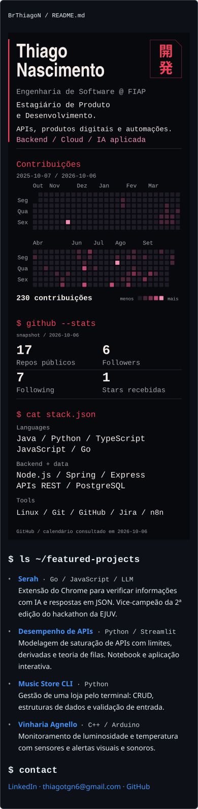
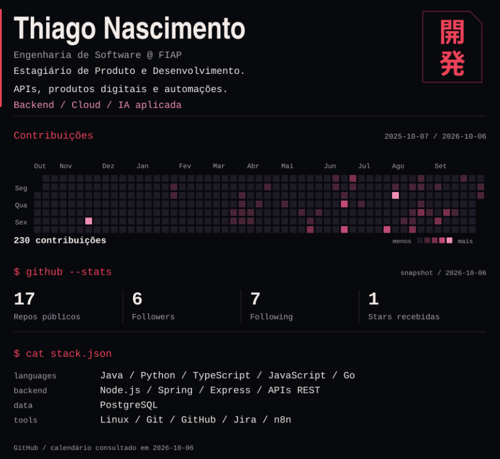
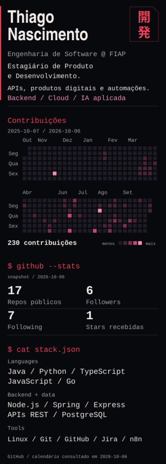

# Manutenção do dashboard

O README apresenta o perfil e os quatro projetos originais. A composição visual é gerada em SVG, com tema escuro fixo, tipografia condensada e monoespaçada, vermelho/rosa e um selo japonês vetorial. O layout é dimensionado para a coluna de README do GitHub; a sidebar e o avatar ficam na interface nativa do perfil. Não há dependência de widgets externos.

## Arquivos

| Arquivo | Responsabilidade |
| --- | --- |
| `scripts/profile.json` | Textos e stack declarada, derivados do README anterior. |
| `scripts/generate_dashboard.py` | Consulta dados, valida snapshots e desenha os dois layouts. Python 3.12+, biblioteca padrão. |
| `assets/profile-data.json` | Último resultado válido de cada fonte, com período e data da consulta. Sem credenciais. |
| `assets/avatar.jpg` | Avatar real preservado como asset; a interface do GitHub já mostra a foto fora do README. |
| `assets/development-mark.svg` | Selo “開発” (desenvolvimento), com glifos convertidos em contornos SVG. |
| `assets/dashboard.svg` | Documento para a coluna do README, `viewBox="0 0 880 808"`. |
| `assets/dashboard-mobile.svg` | Layout vertical, `viewBox="0 0 440 1224"`, com o mesmo calendário em duas faixas. |
| `assets/previews/*.png` | Prévias estáticas do dashboard e do retângulo completo do README, em desktop e mobile. |
| `scripts/render_previews.py` | Ferramenta opcional de revisão local para exportar as quatro prévias PNG. |
| `docs/design-notes.md` | Paleta, tipografia, proporções e decisões da direção visual. |
| `.github/workflows/update-profile.yml` | Validação e atualização diária, manual ou por push relevante. |
| `tests/test_generate_dashboard.py` | Falhas de API, integridade de dados, segurança e limites dos painéis. |

Edite os textos em `scripts/profile.json` e os projetos ou contatos clicáveis no README. Depois regenere os SVGs. Não edite os SVGs manualmente.

## Geração local

Reproduzir exatamente os assets versionados, sem token ou acesso à rede:

```sh
python3 scripts/generate_dashboard.py --offline
python3 scripts/generate_dashboard.py --offline --check
python3 -m unittest discover -s tests -v
```

Atualizar os dados quando `GITHUB_TOKEN` já estiver definido no ambiente:

```sh
python3 scripts/generate_dashboard.py
```

Sem token, o modo padrão termina com código 2 e uma orientação clara, antes de escrever arquivos. O script não lê `.env`, não recebe token por argumento e não imprime respostas de autenticação.

Para um bootstrap público local, há um modo explícito sem token:

```sh
python3 scripts/generate_dashboard.py --public
```

Esse modo usa REST público e o calendário publicado pelo próprio GitHub. O parser exige data, contagem e intensidade de todos os dias do período. Uma mudança no HTML causa falha desse componente, preservando o snapshot anterior; dias ausentes nunca são convertidos em zero. A primeira geração foi feita assim, pois não havia `GITHUB_TOKEN` no ambiente local. O workflow utiliza REST e GraphQL autenticados, sem scraping nem secrets adicionais.

`--date YYYY-MM-DD` define o fim do período do calendário; a data da consulta continua sendo a data real em São Paulo. `--output-dir` permite gerar assets em outra pasta. O modo offline usa o período já registrado no snapshot.

## Significado dos dados

- **Repos públicos, followers e following:** campos da API REST de usuários. Repos públicos inclui forks, conforme a definição do GitHub.
- **Stars recebidas:** soma de `stargazers_count` de todos os repositórios públicos próprios, incluindo arquivados e excluindo forks. A paginação é completa; uma página com erro invalida a atualização inteira dessa métrica.
- **Contribuições:** calendário de um ano móvel, inclusivo, com dias, contagens e intensidades fornecidos pelo GitHub. O total é validado contra a soma diária. No workflow, o resultado reflete o que o `GITHUB_TOKEN` pode consultar; não implica acesso às contribuições de repositórios privados. Pode diferir do perfil visto por uma sessão com outras permissões.
- **Snapshots:** cada componente guarda sua própria data. Se uma consulta falhar, o componente anterior mantém dados e data originais. A data do calendário aparece no rodapé; as datas das métricas aparecem no painel de stats. Sem snapshot, o SVG mostra indisponibilidade, sem números fabricados.
- **Core Stack:** tecnologias declaradas no README original, sem porcentagens ou níveis de domínio. A inspeção da API de linguagens encontrou 224.726 bytes de Jupyter Notebook no projeto de desempenho de APIs, além de um volume considerável de HTML, CSS e SCSS. Agregar esses bytes não representaria bem o foco profissional em backend. Não há barras de habilidade.

Não são calculados streaks ou contagens de commits: eles acrescentariam definições e limitações de visibilidade que não ajudam a apresentação.

## Automação e segurança

O workflow roda diariamente às **06:23 em São Paulo** (`09:23 UTC`), via `workflow_dispatch`, e em pushes relevantes na `main` ou em branches `feat/profile-*`. Alterações do selo vetorial também disparam a geração. O agendamento do GitHub só entra em vigor depois do merge na branch padrão. Alterações de README e assets também são verificadas em pull requests.

O job de validação usa `contents: read`, sem credenciais persistidas. O job de atualização recebe apenas `contents: write`, necessário para commitar os assets. Pull requests executam somente a validação; nenhum código de PR recebe permissão de escrita.

As únicas actions são `actions/checkout` e `actions/setup-python`, fixadas por SHA de commit. Não há instalação de pacotes Python. O token fica no ambiente do passo de consulta; a credencial temporária do checkout permite o push e é removida no encerramento do job.

Somente assets são adicionados ao commit `chore(profile): update dashboard`, e apenas quando há mudanças. Os paths de push não incluem os assets gerados. Commits feitos com `GITHUB_TOKEN` também não disparam novos workflows de push. Não há force push; um avanço concorrente da branch rejeita o push e preserva o trabalho remoto.

Se a política da branch padrão proibir commits diretos, a geração continua válida, mas o push automático será rejeitado pela proteção. Nesse caso, o passo de publicação deve ser adaptado ao fluxo de pull requests do repositório, respeitando a política existente.

## Compatibilidade e revisão visual

O README usa `<picture>` com `source media="(max-width: 640px)"` para escolher o layout compacto. O `` desktop é o fallback. Os SVGs têm `viewBox`, título, descrição e textos XML escapados. O selo japonês usa contornos, sem exigir uma fonte CJK no navegador. Não usam JavaScript, `foreignObject`, fontes externas, animação ou imagens remotas.

SVGs exibidos por `` não oferecem links internos clicáveis. Por isso os contatos permanecem em Markdown, junto aos projetos, abaixo do dashboard.

Os textos foram revisados nos dois layouts e os testes verificam limites conservadores de fonte monoespaçada. O calendário também é verificado com 54 semanas em um ano bissexto, para evitar cortes e sobreposição com a legenda. O tema escuro é preservado em light mode para manter a identidade visual.

### Prévias para revisão

Estas imagens registram o layout com dados de **6 de outubro de 2026**. São exportações estáticas para revisão; o README usa os SVGs atualizados pelo workflow. As prévias em contexto simulam a moldura do GitHub e o Markdown nativo, sem representar uma versão publicada.

**README no desktop — moldura de 896 px, conteúdo de 848 px**


**README no celular — moldura de 390 px**



**Desktop**



**Mobile**



Para refazer as prévias em uma máquina com PyGObject/GdkPixbuf e pycairo disponíveis no sistema:

```sh
python3 scripts/render_previews.py
```

Essas bibliotecas são usadas apenas na exportação PNG local. O gerador de dados e o workflow continuam usando exclusivamente a biblioteca padrão do Python.

Os contornos do selo foram derivados da fonte Noto Sans CJK JP (Google, SIL Open Font License 1.1), disponível no sistema durante a criação. O asset versionado contém somente os contornos dos dois glifos, sem um arquivo de fonte. Fonte: [Noto CJK](https://github.com/notofonts/noto-cjk).

Fontes técnicas: [contribuições na API GraphQL](https://docs.github.com/en/graphql/reference/users#contributioncalendar), [permissões e comportamento do GITHUB_TOKEN](https://docs.github.com/en/actions/concepts/security/github_token), [classificação de linguagens pelo Linguist](https://github.com/github-linguist/linguist/blob/main/docs/how-linguist-works.md).
